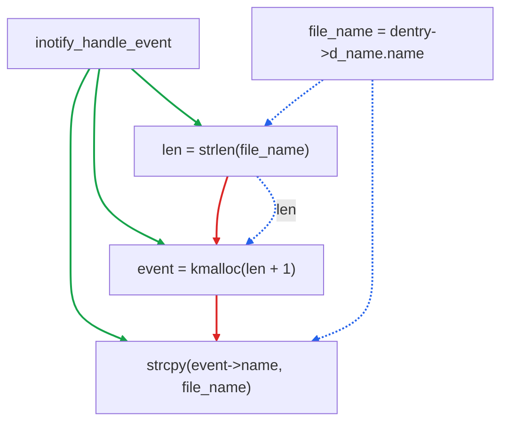

In July 2026, OpenAI's security-specialized model GPT-5.6-Cyber posted high scores on vulnerability-exploitation benchmarks and independently discovered a high-severity vulnerability in Chrome's V8 engine, which Google promptly patched. This shows that on the attack side, large models can already discover and exploit zero-day vulnerabilities autonomously. The defense side must therefore perform codebase-scale vulnerability analysis at equal scale and speed, ahead of attackers — and the difficulty of this task lies precisely in the size of the codebase itself.

The most direct approach is to let an LLM read the source code and detect vulnerabilities, but in practice it runs into three limits at once:

1. **Context capacity.** Deep call chains and many files mean that stuffing whole files into context blows the token budget. The 2026 "Navigation Paradox" paper [1] showed that even loading a 3,500-line repository entirely into a 1M-token window yields only 76.2% architecture coverage for an agent, whereas switching to graph navigation raises it to 99.4% — enlarging the window merely converts "can't fit" into "can't find."
2. **Global structure is invisible.** Cross-function data flow and control flow are invisible in linear text. For vulnerabilities such as critical-section races, the reader and the writer sit on two entirely different call stacks; reading either function alone reveals nothing.
3. **Irrelevant paths induce false positives.** Irrelevant paths are noise, and noise induces hallucinated false positives. LLMDFA (NeurIPS 2024) [2] observed that most false positives produced by LLMs reading raw source come from hallucination during the dataflow-summarization stage.

## A Graph-Based Detection Approach

Our idea is to put a graph layer in front of the model: build a code property graph from the code to give the model reliable contextual evidence. In one line: **structural facts are computed by the graph; semantic judgments are made by the model.**

### Building the Code Property Graph

A code property graph (CPG [3]) turns code into a graph with three layers: the abstract syntax tree (AST), the control flow graph (CFG), and the data dependence graph (DDG). The AST identifies dangerous calls such as `memcpy` and `strcpy`; the CFG captures path reachability; the DDG tracks taint propagation from source to sink. Evidence for a real vulnerability is usually the conjunction of all three kinds of information — missing any one makes the judgment impossible.

The core node and edge types are:

| Category | Type | Meaning |
|----------|------|---------|
| Node | METHOD · LOCAL · CALL · CONTROL_STRUCTURE | Functions, local variables, call sites (e.g. strcpy, kmalloc), control structures (if / while) |
| Edge · AST | CONTAINS · EVAL_TYPE · REF · INVOKES · INHERITS_FROM | Structure layer: containment, evaluated type, reference binding, calls, and type inheritance |
| Edge · CFG | CFG · CDG | Control-flow layer: execution order and control dependence, capturing path reachability |
| Edge · DDG | REACHING_DEF | Data-flow layer: reaching definitions, i.e. the taint path from source to sink |

### Three-Stage Detection: Query, Slice, Judge

After extracting the CPG from source, we load it into the graph database NeuG [4]; all subsequent detection runs as Cypher queries over this graph. We chose NeuG because it supports large graphs and incremental updates, and provides graph-structure, full-text, and vector retrieval in a single engine.

The whole flow can be summarized as: **the LLM guesses the type → the graph supplies evidence → the LLM makes the call.** First the LLM reads the target function and proposes candidate vulnerability types (buffer overflow, TOCTOU, double free, …); once the type is fixed, the graph query has a direction. Then three stages:

1. **Query**: translate the LLM's hypothesis into a Cypher query over the CPG; after matching candidate results, the engine completes the context via BFS.
2. **Slice**: from the query and completion results, generate a program slice; every line in the slice lies on the evidence chain for the final localization.
3. **Judge**: return the slice to the LLM and ask whether it is a real vulnerability.

If the evidence is insufficient, the model can re-run this detection; the whole process runs at most ten rounds.

## A Real Case: CVE-2017-7533

We walk through a real bug (CVE-2017-7533, a heap overflow in the Linux kernel).

The problem is in `inotify_handle_event`: it reads the filename length with `strlen`, allocates a buffer of that size with `kmalloc`, then copies the filename in with `strcpy`. But between the two reads, another `rename` path may lengthen the filename, so `strcpy` writes more bytes than were allocated — a heap overflow. To confirm it, three facts must hold simultaneously: `len` flows to `strcpy`; `file_name` is an alias of shared mutable memory; the reader does not hold the writer's lock. The read and write sit on two call stacks, with code spread across six functions and about a thousand lines; the skeleton is:

```c
/* reader stack · __fsnotify_parent → … → inotify_handle_event */
file_name = dentry->d_name.name;   /* bare pointer, no lock held */
len = strlen(file_name);           /* T1 */
event = kmalloc(sizeof(*) + len + 1);
strcpy(event->name, file_name);    /* T4 · SINK */

/* writer stack · vfs_rename → d_move → __d_move */
spin_lock(&dentry->d_lock);
copy_name(dentry, target);         /* rewrites d_iname[] contents */
spin_unlock(&dentry->d_lock);

/* the only connection between the two: dentry->d_iname[32] */
```

The only connection between the two stacks is the shared memory `d_iname[32]` inside the dentry.

### Method 1: Let the LLM read the source directly

Asking the LLM to localize it by reading source hits two problems:

1. **No global view.** This alias relation has no directly searchable string in the source; reading either the reader stack or the writer stack alone cannot reveal that both share the same memory with a race window, so the model cannot learn the concurrency condition needed to trigger the bug — constructing a PoC is out of the question.
2. **Irrelevant results drown the evidence.** Grepping for `d_iname`, `file_name`, etc. hits many syntactically valid but irrelevant sites; the few critical lines are drowned in noise, which instead induces hallucinated false positives.

Combined, the model neither sees the cross-stack concurrency condition nor escapes the noise: it either misses the bug or emits unreproducible false positives, never localizing the real vulnerability.

### Method 2: Locate it on the CPG

Switch to the CPG approach. Building the graph from the snippet above yields, simplified:



Figure 1 · The CPG for the case code: green solid edges are AST edges (function contains statements), red solid edges are CFG edges (statement execution order), and blue dashed edges are DDG edges (the definition of `len` reaches `kmalloc`; `file_name` is dereferenced at both `strlen` and `strcpy`); all three edge classes overlay the same node set.

The LLM first judges that this may be a critical-section race, then translates that hypothesis into Cypher queries, one per fact:

```cypher
// ① can the data flow of len reach strcpy (the sink), across functions and indirect calls
MATCH path = (def {name:'len'})-[:REACHING_DEF*1..6]->(sink:CALL {name:'strcpy'})
RETURN path;

// ② is file_name an alias of shared mutable memory
MATCH (v:LOCAL {name:'file_name'})-[:ALIAS]->(m)
WHERE m.mutable AND m.shared
RETURN v, m;

// ③ does the reader hold the writer's lock d_lock
MATCH (reader)-[:REACHING_DEF*]->(:CALL {name:'strcpy'})
WHERE NOT (reader)-[:HOLDS_LOCK]->(:LOCK {name:'d_lock'})
RETURN reader;
```

The engine matches the corresponding patterns, completes full paths via BFS over REACHING_DEF, and finally produces a program slice of only a few lines:

```c
/* SLICE · src = dentry->d_name.name */
 89:         len = strlen(file_name);           /* READ@T1 · def of len */
 90:         alloc_len += len + 1;              /* REACHING_DEF len→alloc_len */
 99:     event = kmalloc(alloc_len, GFP_KERNEL); /* REACHING_DEF alloc_len→size */
109:         strcpy(event->name, file_name);    /* READ@T4 · SINK · unbounded write */
/* ALIAS file_name → d_name.name · MUTABLE_SHARED */
/* LOCK cover(reader)=∅ · locks(writer)={d_lock} */
```

Feeding this slice to the LLM, it concludes: yes, a bug. One thread repeatedly opens files to trigger IN_OPEN events and invoke `inotify_handle_event`, while another thread flips the filename between 1 and 24 characters; when the race hits, `strlen` measures 1 character and allocates 2 bytes, but by the time `strcpy` runs the name is 24 characters, so 25 bytes are copied into a 2-byte slot — 23 bytes out of bounds, a heap overflow.

Looking back, the value of the graph approach concentrates in three points:

- **Global visibility.** Cross-stack alias and lock-coverage relations become explicit edges; evidence scattered across six functions and ~1,000 lines is connected by a single query, no longer depending on the model "happening to read" the one key line.
- **Deterministic and reproducible.** Data flow and control flow are computed by the graph engine; the same query returns the same path every time, avoiding the hallucination of LLM dataflow summarization.
- **Noise removed.** The slice keeps only the evidence-chain lines; irrelevant code never enters the context, cutting both token cost and false positives.

## Evaluation

We validate the final effect with three experiments, on synthetic data (FormAI), real vulnerabilities (CyberGym), and real codebases. All experiments control variables: the same model (Qwen-3.7-max) and the same prompt, with the only difference being whether a CPG slice is provided. In the bar charts, gray bars are the LLM-only baseline and red bars are NeuG.

**Exp 1 · FormAI (383 samples × 12 rounds).** With the CPG slices provided by NeuG, Precision rises from 55.4% to 74.2%, Recall from 69.7% to 81.0%, and F1 from 61.5% to 77.0%. More persuasive than the mean is the change in variance: the LLM-only F1 over the twelve rounds swings between 39.6 and 69.8, while with slices it converges to a narrow band of 76.0–78.3, with standard deviation dropping from 5.9% to 0.8%. Since the same configuration run twelve times should give similar results, output stability matters more than the mean in engineering terms.


**Exp 2 · CyberGym/ARVO (312 real-vulnerability tasks).** With the CPG slices, F1 rises from 58.2% to 71.3%. This score is lower than Exp 1, which is expected — real vulnerabilities are harder to detect than synthetic samples. The ground truth is not hand-labeled but reverse-derived from fix patches: intersecting the old-side hunk line ranges of a patch with function line ranges yields the vulnerable-function set; judging requires the LLM to return source locations, counted as detected only if the returned location falls inside the truth set, so merely guessing a function name scores nothing.


**Exp 3 · Large repositories (20 open-source projects, 10K–200K lines).** We split by code size: 10K–50K lines as S-tier, 50K–200K as L-tier, and report the final F1 per tier. Comparing the CPG approach against direct reading, S-tier mean F1 rises from 61.1 to 76.8 and L-tier from 47.4 to 70.9, while token consumption roughly halves (L-tier from 314K to 149K). The larger the repository, the harder direct reading is, and the more pronounced the CPG advantage.


The method works because the slice fixes the input structure: safe code is no longer misjudged, and easily-missed sites are explicitly marked by dataflow; precision, recall, and variance improve together, showing that what matters is the improved quality of the input program slice rather than any other factor.

In NeuG we packaged the full pipeline — from building the CPG out of source to "query → slice → judge" — into an out-of-the-box skill [5], bundling the build flow, a CPG schema cheat-sheet, and Cypher templates.

## Conclusion

Looking back at the whole vulnerability-detection scenario, the division between graph and model is clear: which paths exist, where data flows, and who holds a lock are structural facts handled by graph computation, hence deterministic and reproducible; whether something constitutes a vulnerability and how to phrase it is left to the model. With the graph, the model no longer has to needle-haystack through tens of thousands of lines of code — it receives a complete, deterministic, reproducible code-slice as evidence and judges the vulnerability directly.

If you want to give your own codebase this kind of detection capability, give it a try.

## References

- [1] The Navigation Paradox in Large-Context Agentic Coding: https://arxiv.org/abs/2602.20048
- [2] Wang et al. · LLMDFA: Analyzing Dataflow in Code with Large Language Models: https://arxiv.org/abs/2402.10754
- [3] LLVM meets Code Property Graphs · lowlevelbits.org: https://lowlevelbits.org/llvm-meets-code-property-graphs/
- [4] NeuG · embedded graph database (the CPG storage backend here): https://github.com/alibaba/neug
- [5] NeuG-codescope skill: https://github.com/alibaba/neug/skills/neug-codescope

---

NeuG is an embedded graph database offering unified graph-structure, full-text, and vector retrieval for Agent applications, and serves as the storage and query backend for the CPG in this post.

- GitHub: https://github.com/alibaba/neug
- Stars, Issues, and PRs are welcome
