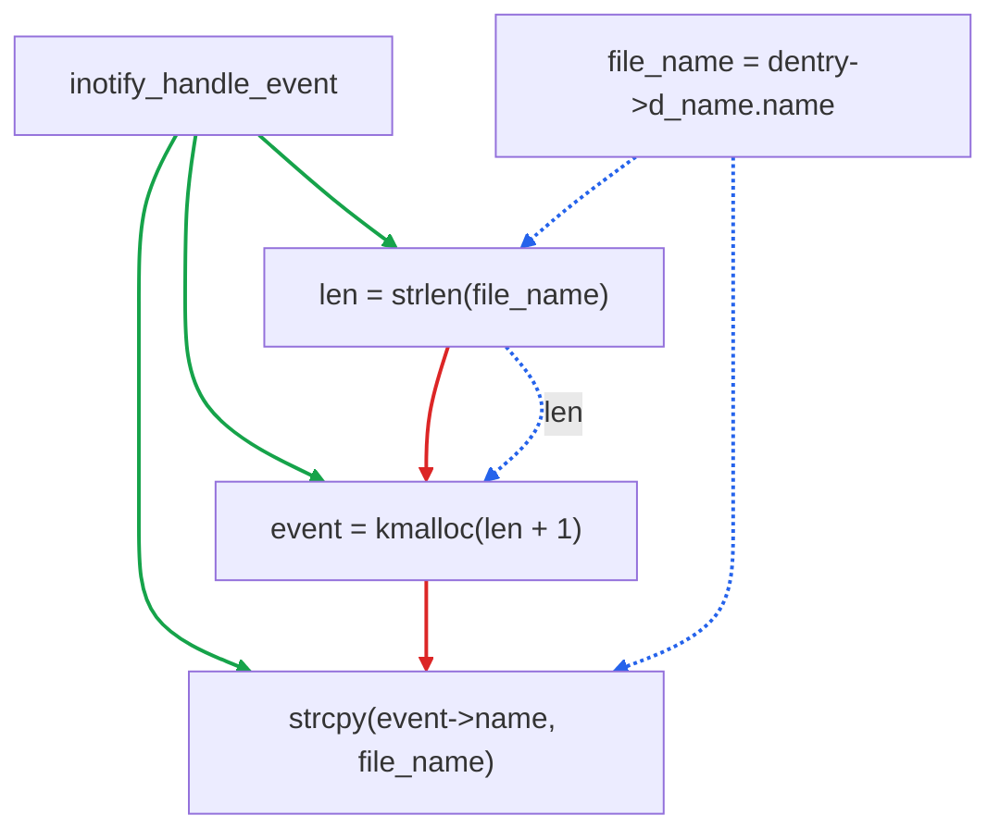

2026 年 7 月，OpenAI 发布的安全特化模型 GPT-5.6-Cyber 在漏洞利用评测中交出高分，并独立发现了 Chrome V8 引擎的一处高危漏洞，谷歌随后紧急修复。这表明大模型在攻击侧已具备自主发现并利用零日漏洞的能力。防御侧因此必须以同等的规模与速度，抢在攻击者之前完成代码库级的漏洞分析——而这项任务的困难，恰恰在于代码库的规模本身。

最直接的方法，是让 LLM 直接阅读源码完成漏洞检测，但在实践中会同时遭遇三个层面的限制：

1. **上下文容量受限。** 由于调用链较深且文件数量较多，将整个文件塞入上下文会导致 token 消耗迅速超出可接受范围；2026 年发表的「Navigation Paradox」[1]一文的测试表明，即便将一个 3,500 行的仓库完整装入 1M 窗口，agent 的架构覆盖率也仅为 76.2%，这意味着扩大窗口只是将失败形式从「装不下」转换为「找不到」。
2. **全局结构不可见。** 跨函数的数据流与控制流在线性文本中并不可见，以临界区冲突为代表的漏洞，其读取者与写入者分别处于两条完全不同的调用栈之中，单独阅读其中任何一个函数都无法发现问题。
3. **无关路径诱发误报。** 无关路径构成噪声，而噪声会诱发幻觉式误报；LLMDFA（NeurIPS 2024）[2] 的观察表明，LLM 直接阅读源码时产生的误报大部分来自数据流总结阶段的幻觉。

## 基于图的漏洞检测方案

基于此，我们的思路是：在模型之前引入一层图结构，基于代码构建一张代码属性图，为模型分析提供可靠的上下文证据，即结构性事实交由图计算，语义性判断交由模型完成。

### 代码属性图的构建

代码属性图（code property graph，CPG [3]）将代码转换成一张图结构，包含了三个层次：抽象语法树（abstract syntax tree，AST）、控制流图（control flow graph，CFG）与数据依赖图（data dependence graph，DDG）。其中 AST 识别 memcpy、strcpy 等危险调用，CFG 刻画路径可达性，DDG 追踪从 source 到 sink 的污点传播。真实漏洞的证据往往是这三类信息的合取，缺少任何一项都无法完成判定。

图建模中核心的点、边类型如下表：

| 类别 | 类型 | 含义 |
|------|------|------|
| 节点 | METHOD · LOCAL · CALL · CONTROL_STRUCTURE | 函数、局部变量、调用点（如 strcpy、kmalloc）、控制结构（if / while）等程序组成部分 |
| 边 · AST | CONTAINS · EVAL_TYPE · REF · INVOKES · INHERITS_FROM | 结构层：包含、求值类型、引用绑定，以及函数调用与类型继承 |
| 边 · CFG | CFG · CDG | 控制流层：语句的执行顺序与控制依赖，刻画路径可达性 |
| 边 · DDG | REACHING_DEF | 数据流层：定义到达，即从 source 到 sink 的污点传播路径 |


### 三阶段检测：查图、切片与判定

从源码抽取出上述 CPG 之后，我们把它导入图数据库 NeuG [4]，后续检测都在这张图上以 Cypher 查询的方式进行。这里，NeuG 支持大规模图及其增量更新，并且提供了图结构、全文与向量检索能力。

整个漏洞检测流程可以概括为「大模型猜类型 → 图上查证据 → 大模型下判定」。首先，我们让大模型阅读目标函数源码，给出候选漏洞类型，如缓冲区溢出、TOCTOU 或 double free；类型确定后，进入三阶段检测，在 CPG 图上查出关键代码作为证据，再交回大模型判断漏洞是否真实存在：

1. 查图：LLM 将推断结果翻译为 Cypher 查询，在 CPG 图上进行查询。在匹配到具体可能的结果后，引擎还会通过 BFS 补全上下文；
2. 切片：基于查图和补全的结果，生成对应的程序切片，切片中的每一行都对应于最后漏洞定位的证据链；
3. 判定：将切片返回给大模型，要求模型判断是否是漏洞。

若证据不足，模型可再次发起这段检测，整个过程至多进行十轮。

## 真实 case 示例

我们以一个真实的 bug（CVE-2017-7533，Linux 内核里的一处在用堆溢出）为例，说明流水线是如何定位它的。

问题出在 inotify_handle_event 函数里：它先用 strlen 读出文件名长度，让 kmalloc 按此分配缓冲区，再用 strcpy 把文件名拷进去。但两次读取之间，文件名可能被另一条 rename 路径改长，于是 strcpy 拷入的字节数超出已分配的大小，造成堆溢出。要坐实这个漏洞，必须同时确认三件事：len 能流到 strcpy、file_name 是共享可变内存的别名、读取者没拿到写入者的锁。而读写分处两条调用栈，代码散落在**六个函数、约一千行里**，骨架可简化为：

```c
/* 读者栈 · __fsnotify_parent → … → inotify_handle_event */
file_name = dentry->d_name.name;   /* 裸指针，不持锁 */
len = strlen(file_name);           /* T1 */
event = kmalloc(sizeof(*) + len + 1);
strcpy(event->name, file_name);    /* T4 · SINK */

/* 写者栈 · vfs_rename → d_move → __d_move */
spin_lock(&dentry->d_lock);
copy_name(dentry, target);         /* 改写 d_iname[] 内容 */
spin_unlock(&dentry->d_lock);

/* 两者唯一的连接：dentry->d_iname[32] */
```

两条调用栈之间唯一的连接，是 dentry 内部的 d_iname[32] 这块共享内存。

### 方式一：直接让大模型读源码

我们直接让 LLM 读源码来定位它，会遇到以下两个问题：

1. **看不到全局信息。** 这一别名关系在源码中不存在任何可直接检索的字符串，单独阅读读栈或写栈，都无法发现二者共享同一块内存、存在竞争窗口；模型因此无法得知触发漏洞所需的并发条件，PoC 的构造也就无从谈起。
2. **无关结果淹没证据。** 若改用 grep 检索 d_iname、file_name 等符号，会命中大量语法正确却与本漏洞无关的位置，真正关键的几行被淹没在噪声里，反而诱发幻觉式误报。

两个问题叠加，模型既看不全跨栈的并发条件，又被大量无关结果干扰，最终要么漏报、要么给出无法复现的误报，始终定位不到这个真正的漏洞。

### 方式二：基于 CPG 图定位

我们改用基于 CPG 图的方案。以前述案例中的代码片段为输入，构建完成后得到的 CPG 可简化表示为如下示例，其中，绿色实线为 AST 边（函数包含语句），红色实线为 CFG 边（语句执行顺序），蓝色虚线为 DDG 边（len 的定义到达 kmalloc，file_name 在 strlen 与 strcpy 处两次被解引用）：



LLM 首先判断它可能是一个临界区冲突的 bug，并把这一推断翻译成 Cypher 查询，围绕前述三个事实各发一条：

```cypher
// ① len 的数据流能否到达 strcpy（sink），允许跨函数、含间接调用
MATCH path = (def {name:'len'})-[:REACHING_DEF*1..6]->(sink:CALL {name:'strcpy'})
RETURN path;

// ② file_name 是否为共享可变内存的别名
MATCH (v:LOCAL {name:'file_name'})-[:ALIAS]->(m)
WHERE m.mutable AND m.shared
RETURN v, m;

// ③ 读取者是否持有写入者的锁 d_lock
MATCH (reader)-[:REACHING_DEF*]->(:CALL {name:'strcpy'})
WHERE NOT (reader)-[:HOLDS_LOCK]->(:LOCK {name:'d_lock'})
RETURN reader;
```

引擎执行查询后命中对应的 pattern，再通过 BFS 在 REACHING_DEF 上补全完整路径，最终得到如下程序切片，仅有数行：

```c
/* SLICE · src = dentry->d_name.name */
 89:         len = strlen(file_name);           /* READ@T1 · def of len */
 90:         alloc_len += len + 1;              /* REACHING_DEF len→alloc_len */
 99:     event = kmalloc(alloc_len, GFP_KERNEL); /* REACHING_DEF alloc_len→size */
109:         strcpy(event->name, file_name);    /* READ@T4 · SINK · 无界写 */
/* ALIAS file_name → d_name.name · MUTABLE_SHARED */
/* LOCK cover(reader)=∅ · locks(writer)={d_lock} */
```

这段切片发给大模型，最终大模型判断，确实是bug：一个线程持续执行 open 以触发 IN_OPEN 事件、拉起 inotify_handle_event，另一个线程将文件名在 1 字符与 24 字符之间反复改写，二者竞争命中时 strlen 按 1 字符量得长度并分配 2 字节，strcpy 执行时文件名已为 24 字符，25 字节被拷入 2 字节的槽位，越界 23 字节，造成堆溢出。

回看这个案例，图方案的价值集中在三点：

- **全局可见。** 跨调用栈的别名与锁覆盖关系被显式建成边，原本散落在六个函数、约一千行里的证据，一次查询就能串起来，不再依赖模型「读到」那关键的一行。
- **确定且可复现。** 数据流与控制流由图引擎计算，同样的查询每次都返回同样的路径，避免了 LLM 直接总结数据流时的幻觉。
- **剪掉噪声。** 程序切片只保留证据链上的行，无关代码不再进入上下文，既压低了 token 消耗，也减少了误报。

## 实验评估

我们进一步通过三组实现来验证最终效果，分别在合成数据（FormAI）、真实数据（CyberGym），以及真实代码库上进行。所有实验均控制变量，即采用同一模型与同一提示词，唯一差异在于是否提供 CPG 切片。各柱状图中，灰色柱为纯 LLM 对照组，红色柱为 NeuG。实验模型为 Qwen-3.7-max。

实验1 在 FormAI 数据集上进行，对 383 个样本重复 12 轮。加入 NeuG 提供的 CPG 切片后，Precision 由 55.4% 提升至 74.2%，Recall由 69.7% 提升至 81.0%，F1 由 61.5% 提升至 77.0%。


实验2 转向真实漏洞，采用 CyberGym/ARVO 的 312 个任务。加入 NeuG 提供的 CPG 切片后，F1 由 58.2% 提升至 71.3%；该分数低于实验1 的结果，我们认为这一现象符合预期，因为真实漏洞本身较合成样本更难检测。


实验3 考察大规模仓库，选取 20 个规模在 10K 至 200K 行之间的开源项目，并按代码量分成两档：10K–50K 行为 S 级，50K–200K 行为 L 级，统计各档最终的 F1。
比较 CPG 方案与直接阅读方式，S 级仓库的平均 F1 从 61.1 提升至 76.8，L 级从 47.4 提升至 70.9，同时 token 消耗约减半（L 级由 314K 降至 149K）。可见仓库规模越大，直接阅读越吃力，CPG 方案的优势也越明显。


方法有效的原因在于切片固定了输入结构：安全代码不再被误判，易遗漏的位置由数据流明确标出；精度、召回与方差三者同时改善，说明起作用的是输入程序切片质量的提高而非其他因素。

我们在 NeuG 中，把从源码构建 CPG、再到「查图 → 切片 → 判定」的完整流水线封装成了一个开箱即用的 skill [5]，内置构图流程、CPG schema 速查表与 Cypher 模板。

## 结论

回顾整个漏洞检测场景，图与模型的分工为：哪些路径存在、数据流向何处、谁持有锁等结构性事实由图计算负责，因而确定且可复现；是否构成漏洞以及如何表述则交由模型完成。有了图，模型不必再在动辄上万行代码里大海捞针，而是拿到一份完整、确定且可复现的代码切片证据，直接判断漏洞。

如果你也想给自己的代码库配上这样的检测能力，欢迎上手试试。

## References

- [1] The Navigation Paradox in Large-Context Agentic Coding https://arxiv.org/abs/2602.20048
- [2] Wang et al. · LLMDFA: Analyzing Dataflow in Code with Large Language Models https://arxiv.org/abs/2402.10754
- [3] LLVM meets Code Property Graphs · lowlevelbits.org：https://lowlevelbits.org/llvm-meets-code-property-graphs/
- [4] NeuG · 嵌入式图数据库（CPG 存储底座）：https://github.com/alibaba/neug
- [5] NeuG-codescope skill： https://github.com/alibaba/neug/skills/neug-codescope
